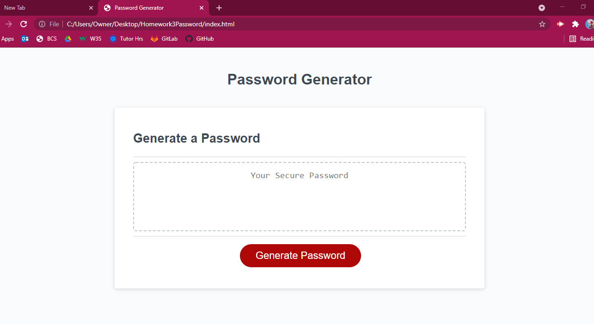

# Homework 3: Password Generator

The perpose of this assignment is for the user to use receive a unique password.
The individual has the choice on if they would like: special characters, upper/lower case letters and numbers.
The generator will work only if the password will be 8-128 characters long.

## Files used
- HTML
- CSS
- JavaScript (JS)

## Link to Application:
https://cathytanya.github.io/password/

## HTML Image:

